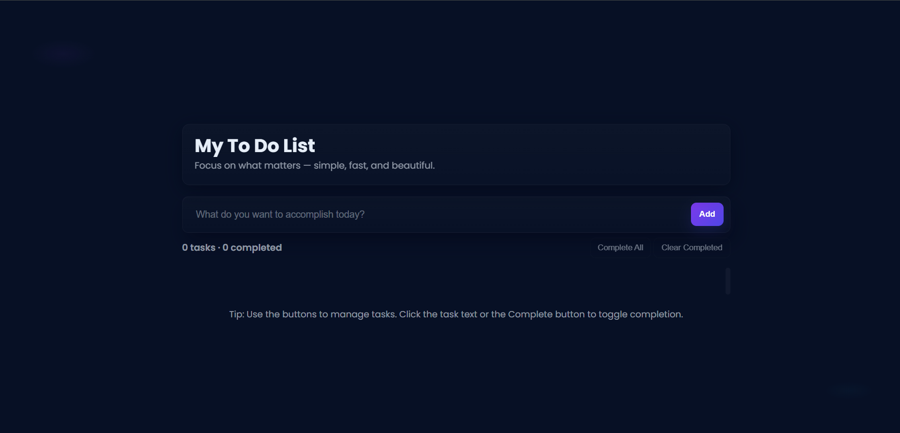
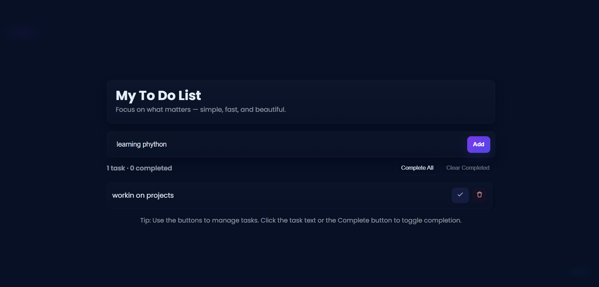
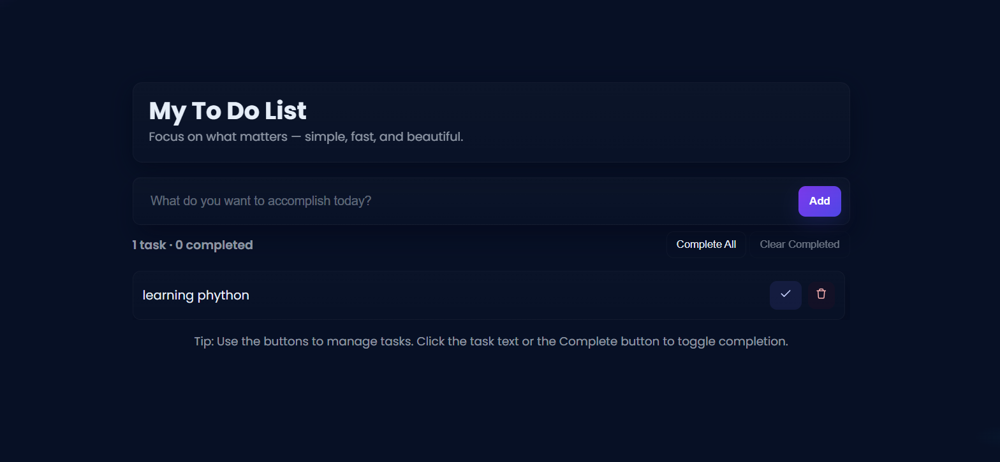
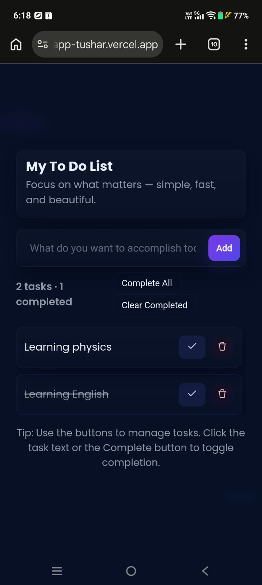

# To-Do List Web Application

## Overview

This project is a responsive To-Do List web application developed using HTML, CSS, and JavaScript. It helps users manage daily tasks efficiently by allowing them to add and remove tasks through a clean and user-friendly interface.

## Features

- Add New Tasks
- Remove Tasks
- Responsive Design
- Simple and User-Friendly Interface
- Real-Time Task Management
- Modern UI Design

## Technologies Used

- HTML5
- CSS3
- JavaScript

## Live Demo

https://synent-task5-todoapp-tushar.vercel.app

## GitHub Repository

https://github.com/tushar-2606/synent-task5-todoapp-tushar

## Project Structure

```plaintext
to-do-list/
│
├── index.html
├── style.css
├── index.js
└── screenshots/
```

## Screenshots

### Home Page



### Add Task



### Remove Task



### Mobile View



## Installation

Clone the repository:

```bash
git https://github.com/tushar-2606/synent-task5-todoapp-tushar.git
```

Open the project folder and run:

```bash
index.html
```

## Learning Outcomes

Through this project, I improved my understanding of:

- DOM Manipulation
- JavaScript Event Handling
- Responsive Web Design
- UI Development
- Task Management Logic

## Author

Tushar Prajapati

## License

This project was created for learning and internship purposes.